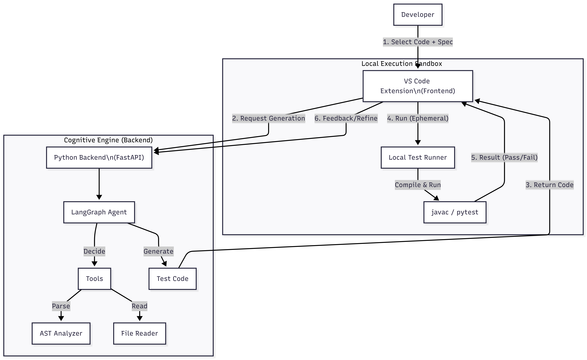
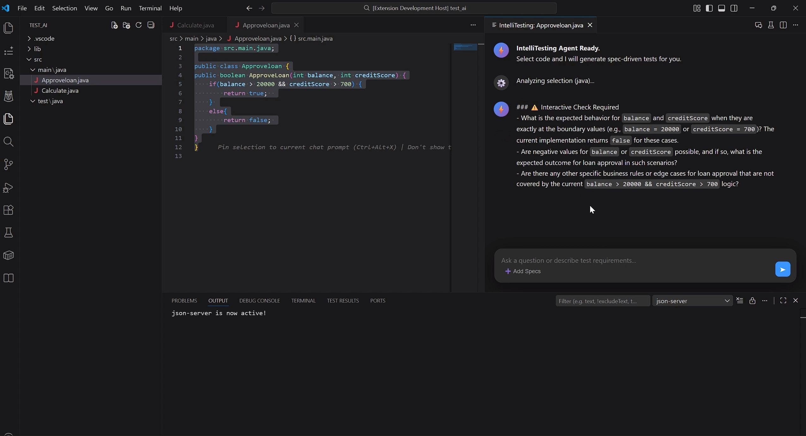
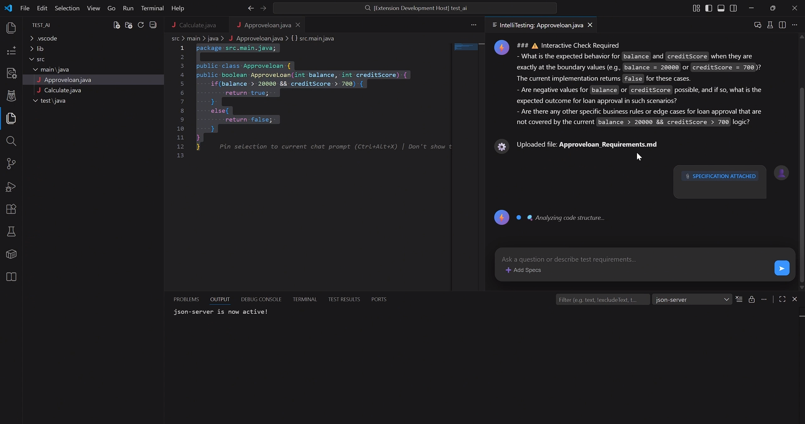
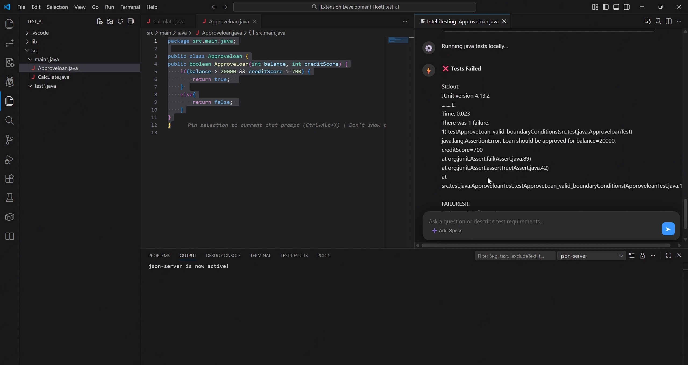

# IntelliTesting
### An Agentic Framework for Specification-Driven Unit Test Generation


**IntelliTesting** is an advanced AI-powered testing assistant built as a VS Code extension. Unlike standard code generators, IntelliTesting adopts an **Agentic Workflow** that prioritizes business specifications (Oracles) over source code implementation. It features an **Interactive Verification Mode** (Human-in-the-loop) to ensure reliability and a **Local Sandbox** for safe test execution.

---

## 🌟 Key Features

* **Interactive Verification Mode (HITL):** Identifies ambiguities in your code and asks for clarification before generating tests. No more guessing business logic!
* **Specification-Driven (Oracle Mode):** Upload or paste requirement documents. The AI treats these as the "Ground Truth," helping you find bugs where code deviates from requirements.
* **Agentic State Machine:** Built on **LangGraph**, the backend reasoning engine uses a cyclical workflow to analyze, plan, and verify test code.
* **Local Ephemeral Sandbox:** Executes generated tests in a secure, temporary environment. Captured output (stdout/stderr) is returned to the UI without polluting your workspace.
* **Copilot-Style UI:** Modern, dark-themed chat interface with live "Thought Chain" animations and one-click Run/Apply actions.

---

## 🏗️ Architecture

IntelliTesting uses a **Hybrid Agentic Architecture**:

1.  **Frontend (TypeScript):** A VS Code extension handling the Webview UI, file I/O, and local test execution.
2.  **Backend (Python):** A FastAPI server running a LangGraph agent that interfaces with **Google Gemini 2.5**.



---

## 🛠️ Technology Stack

| Category | Tools |
| :--- | :--- |
| **Languages** | TypeScript, Python 3.12+ |
| **AI Frameworks** | LangGraph, LangChain, Google Gemini API |
| **Backend** | FastAPI, Pydantic, Uvicorn |
| **Testing Support** | JUnit 4, PyTest |
| **Patterns** | Strategy Pattern (Languages), Factory Pattern (Runners) |

---

## 📸 Screenshots

### 1. Interactive Mode
AI identifying ambiguities and asking clarifying questions.


### 2. Specification-Driven Generation
Generating tests based on an uploaded Requirements document.


### 3. Local Execution & Results
Running JUnit tests in the ephemeral sandbox.


---

## 🚀 Getting Started

### Prerequisites
* **Node.js & npm**
* **Python 3.12+**
* **Java JDK** (for running Java tests)
* **Google Gemini API Key**

### Backend Setup
1.  Navigate to `intellitesting-backend`.
2.  Create a `.env` file: `GEMINI_API_KEY=your_key_here`.
3.  Install dependencies:
    ```bash
    pip install -r requirements.txt
    ```
4.  Start server:
    ```bash
    uvicorn main:app --reload
    ```

### Frontend Setup
1.  Navigate to `intellitesting-frontend`.
2.  Install dependencies:
    ```bash
    npm install
    ```
3.  Compile:
    ```bash
    npm run compile
    ```
4.  Press **F5** in VS Code to launch the extension in a new window.

---

## 📝 Usage

1.  Open a Java file and select the method you want to test.
2.  Click the **Beaker Icon** in the editor title bar.
3.  Answer any questions from the agent or click **➕ Add Specs** to provide requirements.
4.  Click **▶ Run Test** to verify locally.
5.  Click **💾 Apply** to save the generated test suite to your project.

---

## 👨‍💻 Author

**Chengyan Song**
* Student ID: C00292847
* SETU - Final Year Project

---

## ⚖️ License

This project is licensed under the MIT License - see the [LICENSE](LICENSE) file for details.
